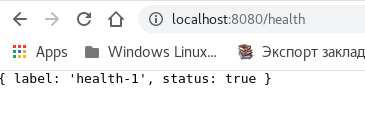

# Scala AutoMapper

* https://github.com/bfil/scala-automapper
  * `Is there something like AutoMapper for Scala?` https://stackoverflow.com/questions/6885558/is-there-something-like-automapper-for-scala
* **(** https://coderoad.ru/6885558/Есть-ли-что-то-вроде-AutoMapper-для-Scala **|**  https://archive.codeplex.com/?p=automapper **)**
  * **(** https://github.com/AutoMapper/AutoMapper **)**

