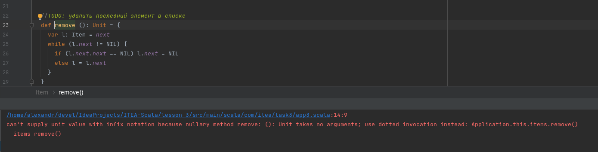
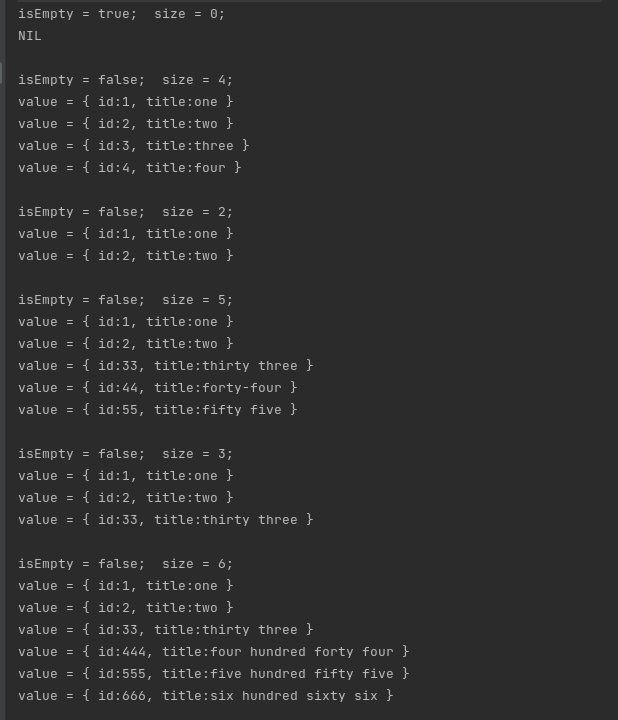

```scala
/home/alexandr/devel/IdeaProjects/ITEA-Scala/lesson_3/src/main/scala/com/itea/task3/app3.scala:12:9
can't supply unit value with infix notation because nullary method print: (): Unit takes no arguments; use dotted invocation instead: Application.this.items.print()
  items print() // NIL 1 2 3 4
```



Declare item list
```scala
val items: Item = Item()
```

Add new item to list
```scala
items add Some(1, "one")
items add Some(2, "two")
items add Some(3, "three")
items add Some(4, "four")
```

Remove item from list
```scala
items.remove
items.remove
```

Print all list of item(s)
```scala
items.print
// NIL  { id:1, title:one }  { id:2, title:two }  { id:33, title:thirty three }  { id:444, title:four hundred forty four }  { id:555, title:five hundred fifty five }  { id:666, title:six hundred sixty six }
```

Use Iterator to iterate the list
```scala
var iterator: Iterator = Iterator()
while ( iterator.hasNext ) {
  val next: Item = iterator.next
  println( "value = " + next.value )
}
```

